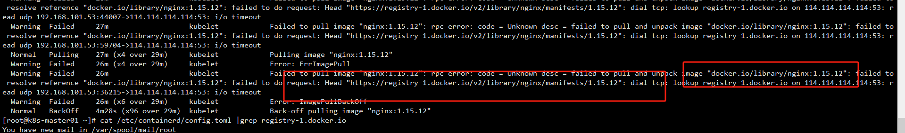

# 拉取超时问题处理

背景：



使用的是containerd

修改相关文件

```
vim /etc/containerd/config.toml


[plugins."io.containerd.grpc.v1.cri".registry.mirrors."docker.io"]
  endpoint = ["http://hub-mirror.c.163.com","https://dockerproxy.com","https://docker.m.daocloud.io","https://reg-mirror.qiniu.com","https://registry.docker-cn.com"]
[plugins."io.containerd.grpc.v1.cri".registry.mirrors."docker.elastic.co"]
  endpoint = ["https://docker.elastic.co","https://elastic.m.daocloud.io"]
```

最重要的传到所有节点

```
for i in k8s-master02 k8s-master03 k8s-node01 k8s-node02;do scp /etc/containerd/config.toml $i:/etc/containerd/ ; done
```

重启相关进程

```
systemctl daemon-reload
systemctl restart containerd
```

